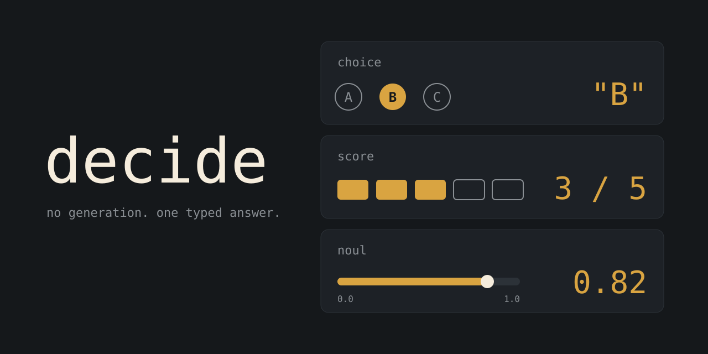

# decide



판단 한 건을 MCP 도구 `decide`로 연다. 문장을 생성하지 않고, 선택(`choice`)·순서형 점수(`score`)·확률(`noul`)을 돌려준다. 출력 형식은 고정돼 있다. 판단이 맞는지와는 별개다.

실행 파일 하나가 백엔드를 둘 가진다.

| `DECIDE_BACKEND` | 동작 |
| --- | --- |
| `typesafe` | `TYPESAFE_API_KEY`로 [TypeSafe.ai](https://api.typesafe.ai) Jev를 호출한다. 키가 비어 있으면 오류다. |
| `local` | 내 Mac에서 도는 `jev-style serve`만 호출한다. 키는 읽지 않는다. |
| 없음 | 키가 있으면 TypeSafe, 없으면 로컬이다. |

한 요청은 고른 백엔드에서만 끝난다. 429 또는 529를 받으면 그 요청만 1초 뒤에 한 번 더 보낸다. 401, 422, 연결 실패는 그 호출의 오류다. 두 백엔드의 확률을 서로 같은 값으로 맞추지는 않는다.

로컬 백엔드는 [Jev-Style-2B-Decision-v3](https://huggingface.co/chaoliangUNSW/Jev-Style-2B-Decision-v3-MLX)(MLX 8bit, 약 2GB, Apache-2.0)를 쓴다. `decide`가 모델을 직접 돌리지 않고, 따로 띄운 `jev-style serve`의 `/v1/systemone`을 호출한다. 그래서 로컬 백엔드에는 Python 서버가 필요하다. TypeSafe 백엔드는 필요 없다. 설정은 아래 "로컬 백엔드"를 본다.

## 붙이기

Apple Silicon Mac에서는 탭으로 깐다.

```bash
brew install sparktype/tap/decide
```

버전은 0.0.4다. 바이너리는 `/opt/homebrew/bin/decide`다. formula는 GitHub Release에 올라간 사전 빌드 arm64 바이너리를 받아 그대로 설치한다 — 설치에 Rust 툴체인이 필요 없다. 가중치와 API 키는 병 밖에 둔다.

```bash
decide install
```

`brew install` 뒤에 위 명령을 실행하면 `claude mcp add -s user decide -- /opt/homebrew/bin/decide mcp`를 대신 실행해 Claude Code 사용자 스코프에 `decide`를 등록한다. `.mcp.json`을 손으로 고칠 필요는 없다. 이 저장소처럼 프로젝트 스코프로 등록하고 싶으면 `.mcp.json`을 직접 쓴다.

```json
{
  "mcpServers": {
    "decide": {
      "command": "/opt/homebrew/bin/decide",
      "args": ["mcp"]
    }
  }
}
```

`.mcp.json`을 고친 뒤에는 세션을 다시 연다. 이미 떠 있는 세션은 등록을 다시 읽지 않는다.

`decide mcp`가 stdio MCP다. 인자 없이 실행하면 도움말이다. `decide daemon`은 `~/.cache/decide/decide.sock`에서 JSON 한 줄을 받고, 30분 동안 요청이 없으면 끝난다. `--help`는 서버를 띄우지 않는다.

도구를 언제 부르고 언제 직접 추론할지는 아래 "에이전트가 쓸 때"를 따른다. 스킬 파일 `.claude/skills/decide/SKILL.md`는 `.gitignore` 대상이라 이 저장소에 포함되지 않는다.

## 로컬 백엔드

키가 없거나 `DECIDE_BACKEND=local`이면 `decide`는 `http://127.0.0.1:8765/v1/systemone`을 부른다. 그 주소에서 서버가 떠 있어야 한다. Apple Silicon Mac 전용이다(MLX).

```bash
# 한 번만. Python 3.12 가상환경에 설치한다. mlx-lm 0.31.3이 함께 고정돼 깔린다.
uv venv jv --python 3.12
uv pip install --python jv/bin/python "jev-style[mlx]"

# 서버를 띄운다. 첫 실행은 가중치(약 2GB)를 받는다.
jv/bin/jev-style serve --release 2b --precision 8bit
```

- 서버는 `127.0.0.1:8765`에만 열리고 인증이 없다. 모델 로딩에 몇 초 걸리니 뜬 뒤에 호출한다.
- `HF_HUB_OFFLINE=1`인 환경이면 첫 실행에서 가중치를 받지 못한다. 그 명령에서만 `HF_HUB_OFFLINE=0`으로 실행해 미리 받아 둔다.
- 다른 주소를 쓰려면 `decide`를 띄우는 환경에 `DECIDE_LOCAL_URL`을 넣는다.
- 서버가 없으면 호출은 `로컬 연결에 실패했습니다: …. jev-style serve가 실행 중인지 확인하세요`라는 도구 오류로 끝난다. TypeSafe로 넘어가지 않는다.
- 실측 지연은 첫 호출 약 1.7초, 이후 호출당 약 50~140ms다(M 시리즈 Mac, 짧은 입력).

### 로그인 때 자동으로 띄우기 (선택)

서버를 매번 손으로 띄우기 싫으면 LaunchAgent로 등록할 수 있다. 템플릿은 `packaging/launchd/dev.sparktype.decide-local.plist`다. 서버를 홈 아래 고정 경로의 가상환경에 설치하고(템플릿이 그 경로를 쓴다), `__HOME__`을 채워 `~/Library/LaunchAgents/`에 둔다. 가중치를 미리 받아 둔 상태여야 한다. 템플릿은 `HF_HUB_OFFLINE=1`로 돈다.

```bash
uv venv ~/.local/share/decide/jev-style --python 3.12
uv pip install --python ~/.local/share/decide/jev-style/bin/python "jev-style[mlx]"
sed "s|__HOME__|$HOME|g" packaging/launchd/dev.sparktype.decide-local.plist \
  > ~/Library/LaunchAgents/dev.sparktype.decide-local.plist
launchctl bootstrap gui/$(id -u) ~/Library/LaunchAgents/dev.sparktype.decide-local.plist
```

끄려면 `launchctl bootout gui/$(id -u)/dev.sparktype.decide-local`을 실행하고 plist를 지운다. 로그는 `~/Library/Logs/decide-local.log`다. 모델을 메모리에 올린 채 상주하므로 메모리를 쓴다(사용량은 재 보지 않았다). 이 템플릿은 문법만 검사했고 실제 기동은 검증하지 않았다.

로컬 답은 TypeSafe 답과 같은 모양이다(`choice`/`score`/`noul`, choice·score의 `probabilities`와 `confidence`, score의 `legend`). 한국어 state도 받는다. 다만 한국어는 8문항 스모크 테스트로만 확인했고 정확도는 재지 않았다. 중요한 판단이면 `probabilities`를 보고 직접 확인한다.

## 사용법

도구 인자는 다섯 개다.

| 인자 | 역할 |
| --- | --- |
| `state` | 판단할 내용 |
| `instructions` | 고정된 질문 |
| `type` | `choice`, `score`, `noul` 중 하나 |
| `options` | `choice`일 때 서로 다른 선택지. 최소 2개 |
| `criteria` | `score`일 때 낮은 쪽부터 나열한 등급. 최소 2개 |

`noul`에는 `options`와 `criteria`를 넣지 않는다. 옵션 한도는 백엔드마다 다르다.

| 백엔드 | `choice` 옵션 | `score` 등급 |
| --- | --- | --- |
| TypeSafe | 255개까지 | 10개까지. 넘으면 호출 전에 오류가 난다. |
| 로컬 | 255개까지. 넘으면 서버가 422로 거절하고 그 메시지가 그대로 돌아온다. | 상한을 확인하지 못했다. |

```text
decide(state="서버가 다운됐습니다", instructions="이 요청이 긴급한가?", type="noul")
decide(state="청구서가 중복 결제됐습니다", instructions="어느 팀이 처리해야 하는가?", type="choice", options=["billing", "technical", "sales"])
decide(state="이미 세 번째 문의입니다", instructions="고객의 불만 강도는?", type="score", criteria=["낮음", "보통", "높음"])
```

반환은 `answer`, `routing`, `latency_ms`다. `routing.backend`는 `typesafe` 또는 `local`이다. `decide daemon`을 거친 호출이 이전 요청과 `state`·`type`·`instructions`·`options`·`criteria`·백엔드가 모두 같으면 `routing.cached`가 `true`이고 `latency_ms`는 0이다 — 이 캐시는 데몬 프로세스 안에서만 유지되고, `decide mcp`(요청마다 새 프로세스)에는 없다.

- `choice`의 `answer.choice`가 고른 라벨이고 `answer.confidence`가 신뢰도다.
- `score`의 `answer.score`는 0부터 등급 개수−1 사이의 기대값이다.
- `noul`의 `answer.noul`은 참/거짓이 아니라 0.0에서 1.0 사이의 확률이다. 임계값은 부르는 쪽에서 정한다. 두 백엔드 모두 noul 답은 `type`과 `noul`만 가진다(`confidence` 없음).

`instructions`는 상태를 바로 묻는 문장으로 쓴다. "Does the customer express satisfaction?"처럼. "Is this NOT a positive review?" 같은 반문은 방향이 쉽게 뒤집힌다. 갈림이 분명해야 하면 `noul` 대신 `choice`에 `positive`와 `negative`를 넣는 편이 안정적이다.

### 질문 여러 개를 한 번에 (`decide_many`)

같은 state에 대해 질문이 여러 개면 `decide_many`로 한 번에 보낸다. 백엔드 호출은 한 번이다. `questions`는 질문 id를 키로 하는 객체이고, 각 질문은 `decide`의 `type`, `instructions`, `options`, `criteria`와 같다.

```text
decide_many(
  state="서버가 다운됐습니다. 결제 API가 500을 반환합니다.",
  questions={
    "urgent": {type: "noul",   instructions: "이 요청이 긴급한가?"},
    "team":   {type: "choice", instructions: "어느 팀이 처리해야 하는가?", options: ["billing", "infra", "sales"]},
    "anger":  {type: "score",  instructions: "고객의 불만 강도는?", criteria: ["낮음", "보통", "높음"]}
  }
)
```

반환은 `answers`(질문 id → 답, 입력 순서), `routing`, `latency_ms`다. 하나라도 검증에 실패하거나 백엔드가 실패하면 전체가 도구 오류이고 부분 결과는 없다. 검증 오류 앞에는 `질문 "<id>": `가 붙는다. 질문 개수 상한은 두지 않고 백엔드가 거절하는 대로 돌려준다. 로컬 서버에서는 질문 수에 비례해 시간이 든다(질문당 약 45ms. 같은 질문 3개를 한 번에 보낸 134ms와 따로 보낸 139ms가 사실상 같았다). 이점은 모델 지연이 아니라 에이전트의 도구 호출 횟수가 줄어드는 것이다.

질문 하나하나는 yes/no나 단일 선택처럼 작게 쪼갠다. 복합 질문은 정확도가 떨어진다. 앞 답에 따라 뒤 질문을 정해야 하면 호출을 나눈다. `decide daemon` 소켓도 줄에 `questions`가 있으면 같은 모양으로 답한다(`type`과 함께 줄 수 없다).

### 에이전트가 쓸 때

- **언제 부르나.** 답이 선택지·등급·확률로 고정되는 판단 한 건일 때 부른다. 서술, 요약, 계획처럼 글을 만들어야 하는 일에는 쓰지 않는다.
- **실패하면.** 그 오류로 작업을 멈추지 않고 직접 추론해서 계속한다. 검증 오류와 백엔드 오류는 도구 오류로 돌아오고, 서버 세션은 유지된다. 로컬 연결 실패는 `jev-style serve`가 안 떠 있다는 뜻이니 사용자에게 한 줄로 알린다.
- **어느 백엔드가 답했나.** `routing.backend`를 본다. 같은 질문이라도 TypeSafe와 로컬의 확률은 보정이 달라 섞어서 비교하지 않는다.
- **임계값.** `noul`을 조건으로 쓸 때 기준은 부르는 쪽이 정한다. 경계 근처(0.3~0.7)면 한 번 더 확인한다.

키는 환경 변수 `TYPESAFE_API_KEY`로만 읽는다. TypeSafe 호출 주소는 `https://api.typesafe.ai/v1/systemone`이고, 요청의 `model`은 `jev-latest`다. 로컬 호출은 같은 본문을 인증 헤더 없이 보낸다.

## 개발

런타임은 `crates/decide`다. 기본 테스트는 가중치와 네트워크 없이 돈다.

```bash
cargo test --manifest-path crates/decide/Cargo.toml
```

이전 Python 패키지는 실행 검증(`cargo test`, TypeSafe 호출, 로컬 호출, 데몬 소켓)이 끝나 지웠다. 저장소에 남은 Python은 표준 라이브러리만 쓰는 Stop 훅 하나다. 테스트 명령은 `cargo test`뿐이다. 실서버(`jev-style serve`, TypeSafe 키)를 쓰는 확인은 기본 테스트에 넣지 않는다.

Stop 훅 `.claude/hooks/stop_verify.py`는 소켓이 없으면 `/opt/homebrew/bin/decide daemon`을 백그라운드로 띄우고, 그 호출은 통과시킨다. 백엔드가 로컬인데 `jev-style serve`가 없으면 데몬 호출이 오류가 되고, 훅은 그 오류를 통과로 처리한다. 두 백엔드의 확률은 보정이 달라서, 백엔드를 바꾸면 임계값이 여전히 맞는지 확인한다. 노울 신뢰도 임계값(기본 0.4)은 `DECIDE_STOP_THRESHOLD` 환경 변수로 바꿀 수 있다.

설계는 `docs/superpowers/specs/2026-09-29-decide-rust-runtime-design.md`에 있다. 로컬 백엔드는 그 문서의 로컬 런타임 절을 대체하는 `docs/superpowers/specs/2026-09-30-decide-local-jev-style-design.md`를 따른다.
